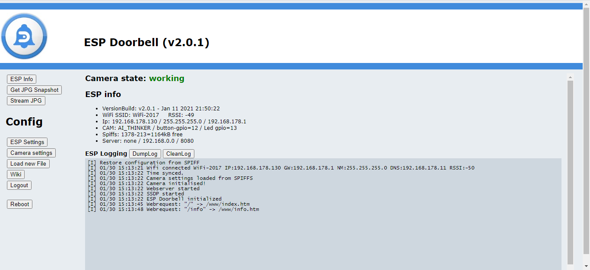
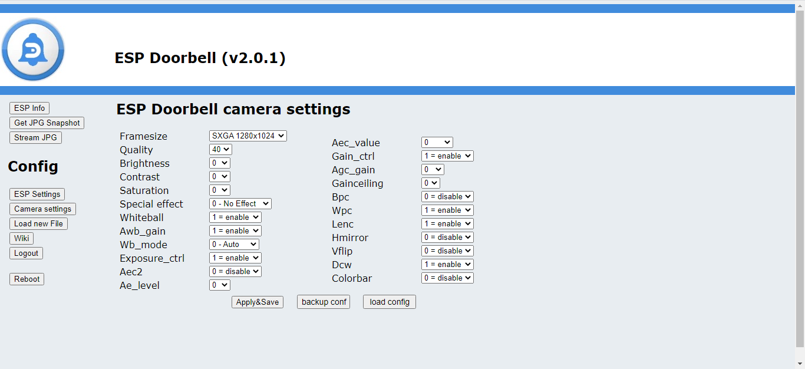
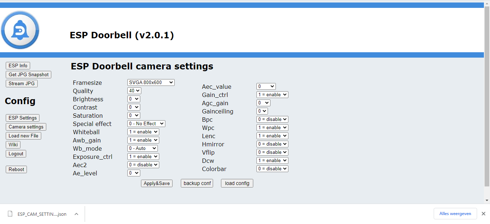
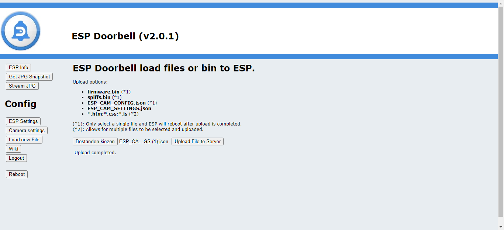

# ESPCAM V2

# Camera Setup

To change the camera settings for the ESP32 doorbell, go to the "Camera settings" button in left column

We don't go in to all settings that are available. Play with it and see what it does.
The settings are the same as supported by the ESP32CAM.

A notification, don't put the framesize to the maximum setting. This doesn't work, because the ESP32 hasn't enough capacity to calculate those big images and transfer them to wifi. 
When you choose a bigger framesize, you could lower quality, to get the images transferred

Some settings that worked in test-situation:
SVGA 800x600, quality 10, working
XGA 1024x768, quality 10, working
XGA 1024x768, quality 15, working
SXGA 1280x1024, quality 35, working

When finished changing the settings, click on "Apply&Save"

It is possible to store the camera settings.
Click on "backup conf", a file "ESP_CAM_SETTINGS.json" will be uploaded to your PC

To restore the "ESP_CAM_SETTINGS.json" to the ESP.
Click on "load config", you will be redirected to "load new file"

Click on "Bestand kiezen" and select "ESP_CAM_SETTINGS.json" and click "open".
To upload, click on "Upload File to Server".
There will be a notification: "upload complete"

The view the image or stream, use these strings which are supported bu the ESP Doorbell:

      Camera JPG Capture
- http://192.168.xxx.xxx/capture
      Camera JPG Stream
- http://192.168.xxx.xxx/stream

When to button is pushed it is possible to send a command to third party systems.

For MQTT
Go to the next step: <a href="../readme_mqtt_setup/README_mqtt_setup.md">mqtt setup</a>

For HTTP/json
Go to the next step: <a href="../readme_mqtt_setup/README_http_json_setup.md">http/json setup</a>
