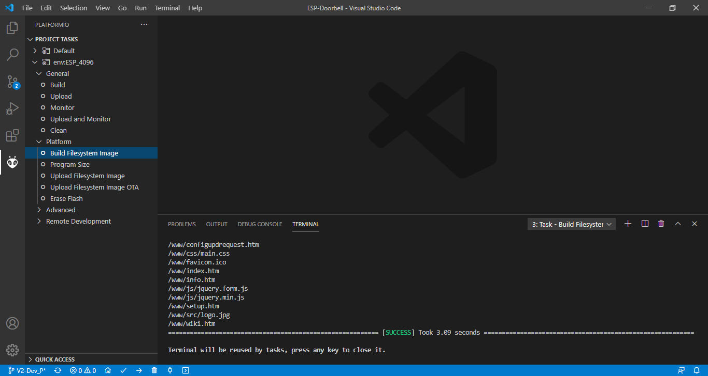

# ESPCAM V2-Dev

# First time files upload

This instruction is based on using a FTDI device, to upload files to a ESP-32-CAM. The ESP-EYE is connected with a micro usb connector, this doesn't need the FTDI device.
We don't get in details how to get the FTDI working on you PC, there is enough information online about drivers and how to.

1). Download the files from github and place them in a folder on you local machine

2). Connect the ESP-32-CAM to the FTDI

3). First build the files which are needed for an upload.
- Open program "Visual Studio Code". 
- Open "File" and select "Open Folder". 
- Select the folder where the files are extracted which downloaded from github.

4). Go to the "platformIO" tab in the left column.
Open the menu and select "Build"
The firmware.bin file will be build. Check that the build finishes with a "success"

5). Moet ik nog invullen, printscreen moet nog worden gemaakt.

6). Also select the "Build Filesystem Image" in the column.
The spiffs.bin file will be build. Check that the build finishes with a "success"

7). Moet ik nog invullen, printscreen moet nog worden gemaakt.

You are finished uploaden the files to the ESP-32-CAM or ESP-EYE.