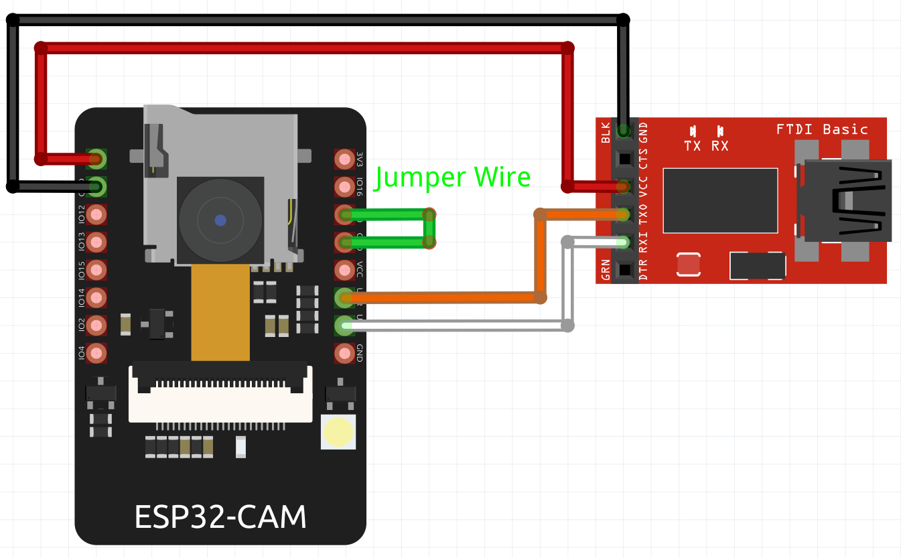
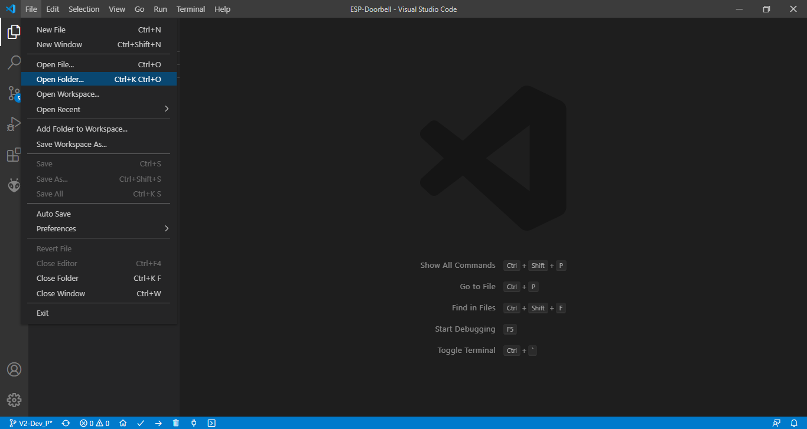
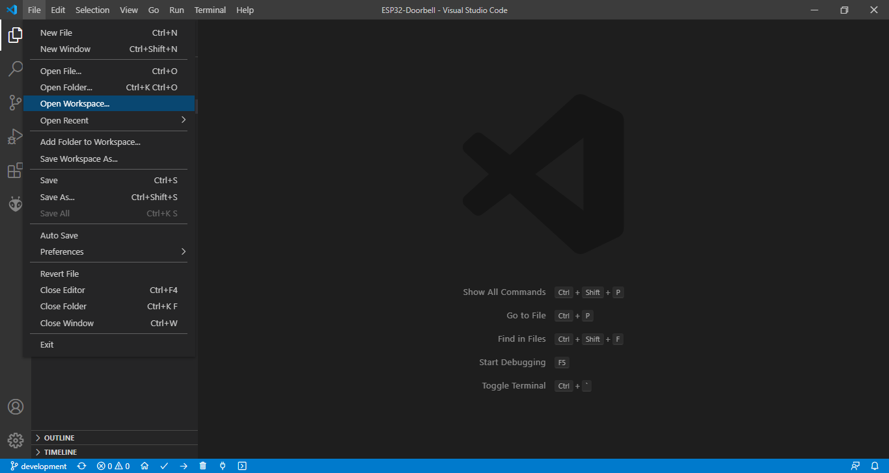
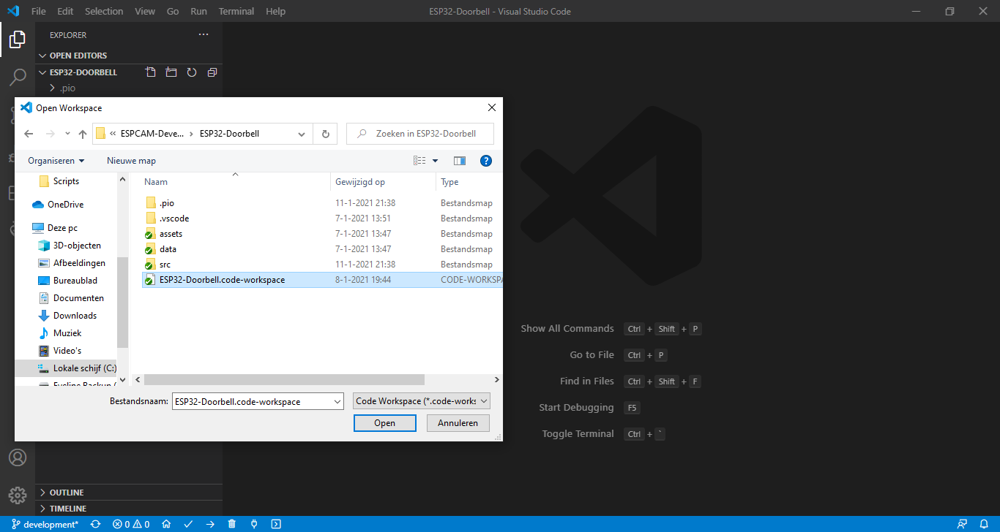
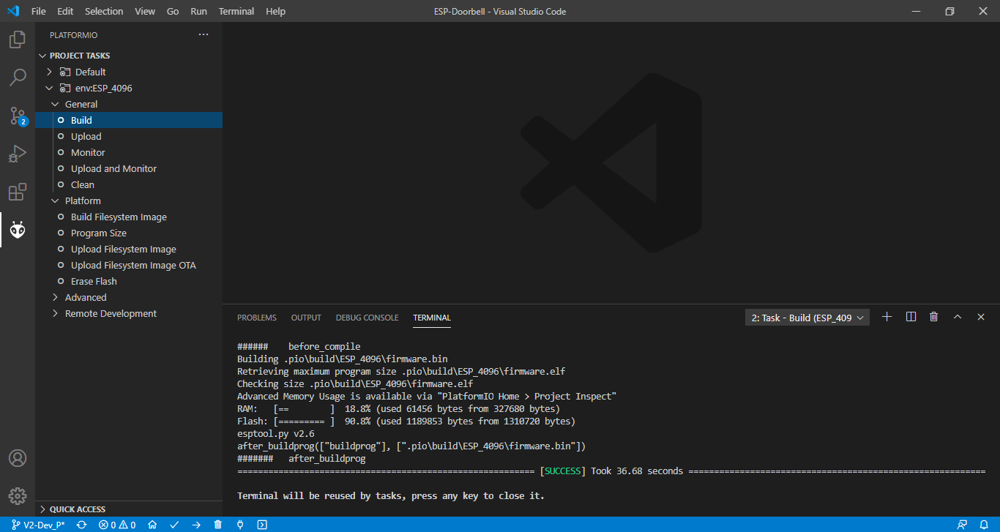
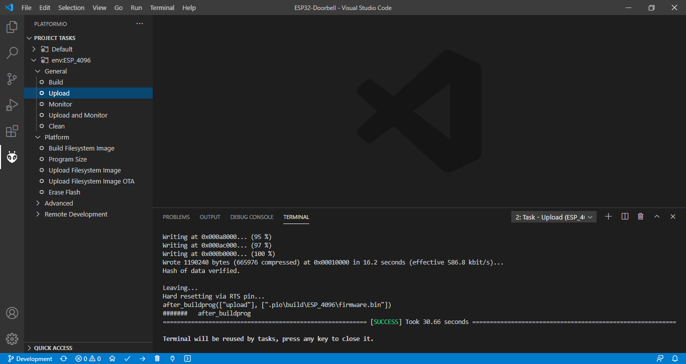
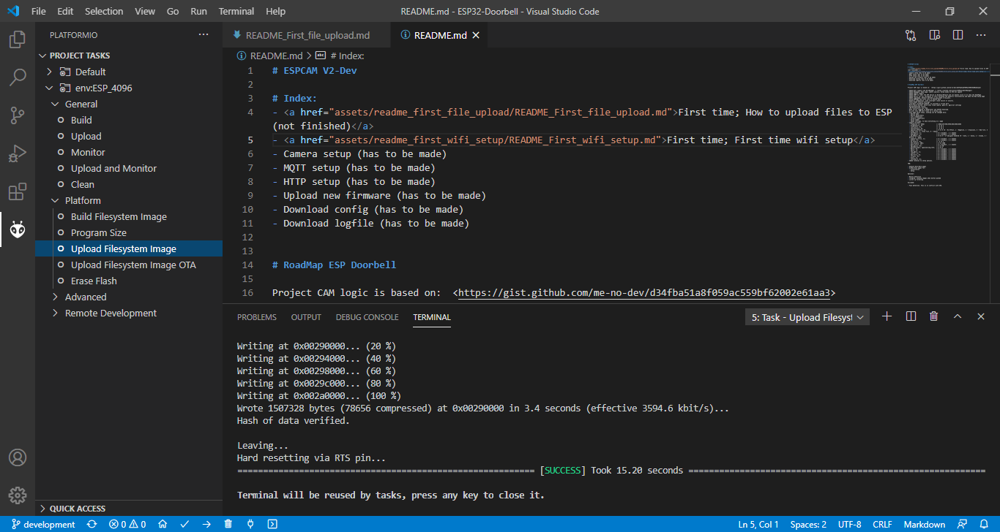

# ESPCAM V2

# First time files upload

This instruction is based on using a FTDI device, to upload files to a ESP-32-CAM. The ESP-EYE is connected with a micro usb connector, this doesn't need the FTDI device.
We don't get in details how to get the FTDI working on you PC, there is enough information online about drivers and how to.

Prerequisite for this tutorial or else use the available bin files and flash them using your prefered method:
- Install Visual Studio Code: https://code.visualstudio.com/download
- Install PlatformIO IDE Extension: https://platformio.org/install/ide?install=vscode
- Install Git: https://git-scm.com/downloads

1). Download the files from github and place them in a folder on you local machine

2). Connect the ESP-32-CAM to the FTDI

3). First build the files which are needed for an upload.
- Open program "Visual Studio Code".
- Open "File" and select "Open Folder".
- Select the folder where the files are extracted which downloaded from github.

4). Set the ESP32-Doorbeel.code-workspace.
- Open "File" and select "Open Workspace".
- Select the file "ESP32-Doorbell.code-workspace" and click "Open".

5). Go to the "platformIO" tab in the left column.
Open the menu and select "Build"
The firmware.bin file will be build. Check that the build finishes with a "success"

6). Connect the ESP32 to your PC and click on "Upload"

7). After a SUCCESS upload, click on "Upload Filesystem Image"

You are finished uploaden the files to the ESP-32-CAM or ESP-EYE.

Go to the next step: <a href="../readme_first_wifi_setup/README_First_wifi_setup.md#espcam-v2">First time wifi setup</a>
