# ESPCAM V2

# First time wifi setup
When you have finished the initial upload to your esp-device, you restart it in normal operation mode. 
The first time the ESP is started, it will go into Wifi AP mode, so  take your PC/smartphone to scan the wifi ssid's. In this example we have taken a smartphone.

1). Open the wifi menu on your device and search for "ESP Doorbell" and select it.

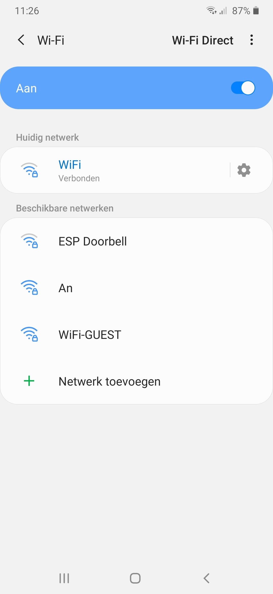

2). Fill in the password. This is "espadmin" and connect.

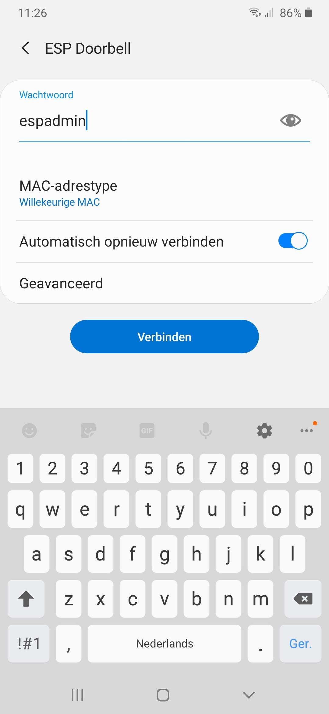

3). When connected to the "ESP Doorbell" AP, you should get a prompt to “Wifi requires login”, click that to open a webbrowser. In case you don’t get a prompt you open de webbrowser and go to http://192.168.4.1.
The wifi-manager will appear. Select "Configure WiFi", to use scan for a visible ssid. When your ssid is invisible, use the "Configure Wifi (No Scan)"

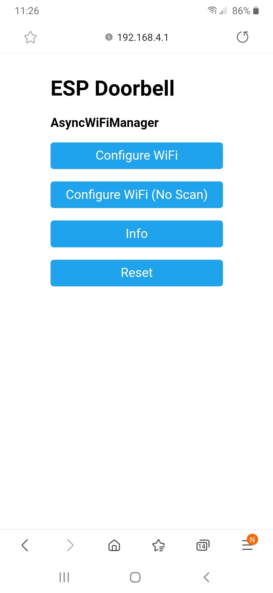

4). Select the ssid to which the "ESP Doorbell" needs to connect. And fill in the password for this ssid, finish with "save"

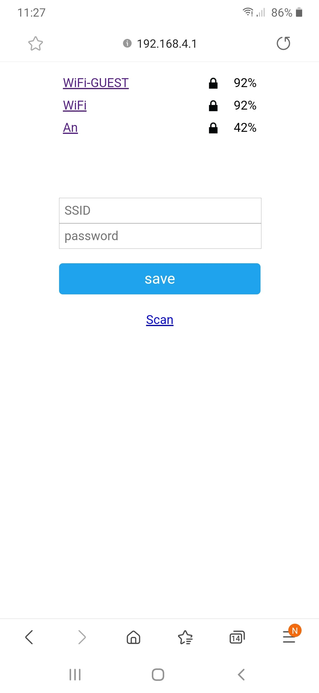

5). The "ESP Doorbell" will try to connect to your selected ssid.

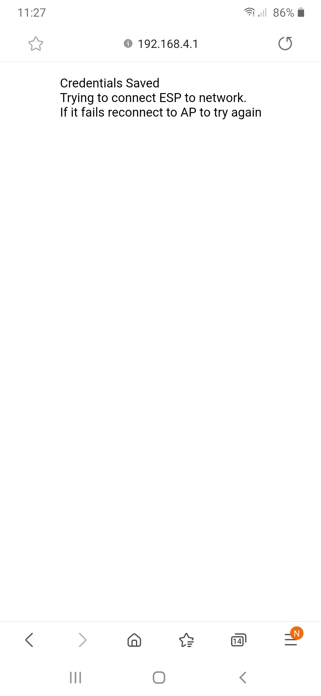

6). Open "Windows Explorer" and go to "Network". 
When the "ESP Doorbell" is succesfully connected to your ssid, than it will be displayed here.
Do a double click on this "ESP Doorbell"

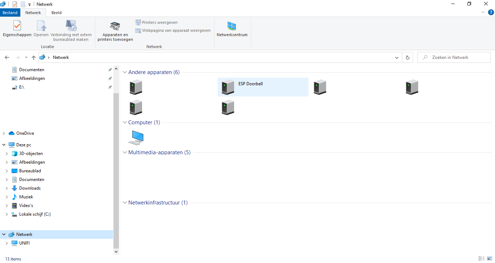

7). The browser will open and shows the login page of the "ESP Doorbell", login on the "ESP Doorbell"

Default user: admin

Default pass: espadmin

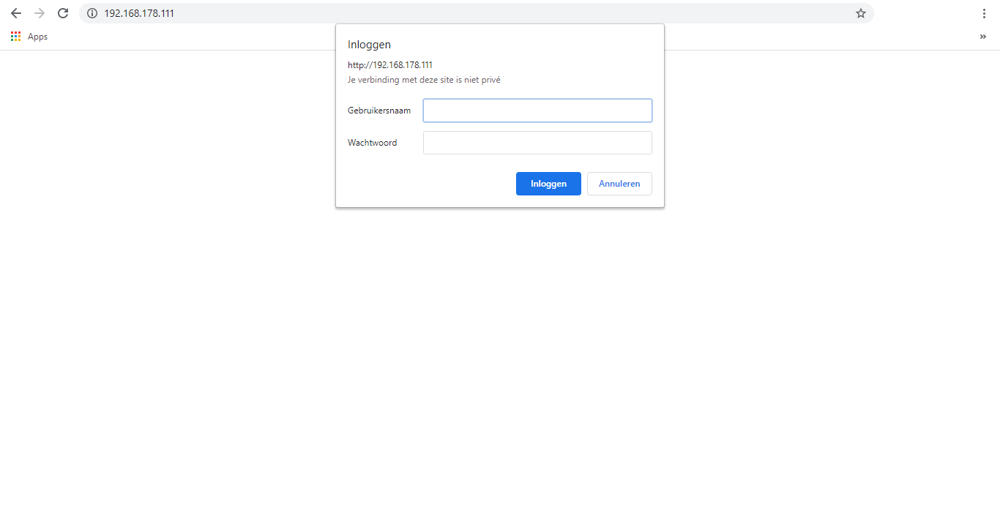

8). After logging in, your first have to select the correct "ESP Board".

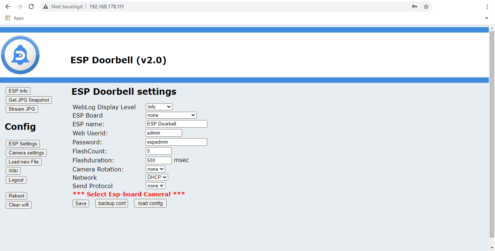

9). Select the correct one. We are not responsible if you select the wrong one and the board gets damaged.
Do a double check if the correct board is selected and "Save" the config.

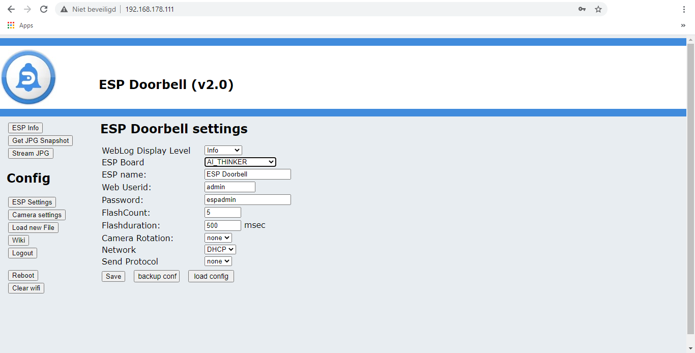

10). Config will be saved, "ESP Doorbell" will reboot.

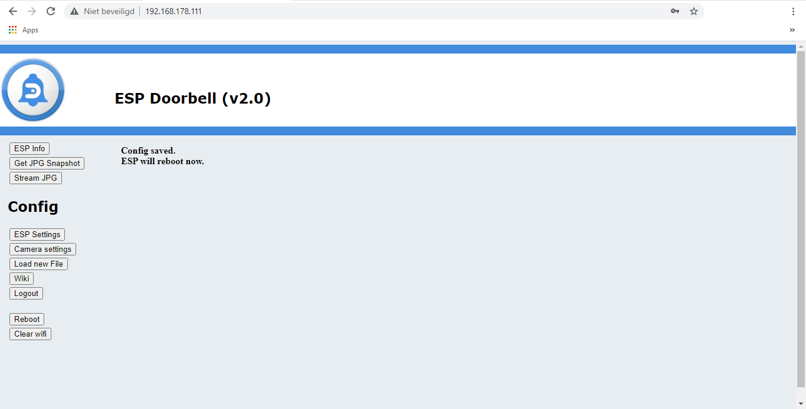

11). The "ESP Doorbell" will come back on the "ESP Info" page. 

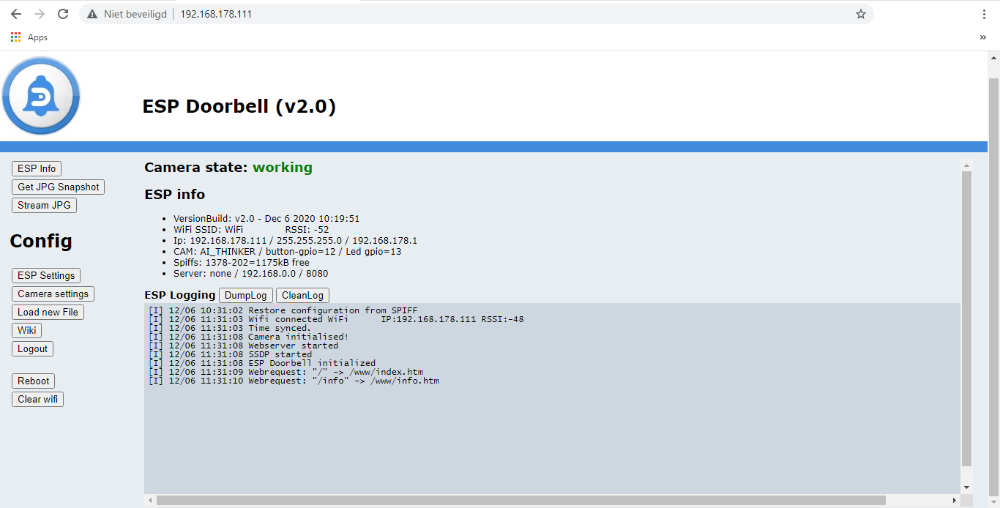

You are finished setting up Wifi to the ESP-32-CAM or ESP-EYE.

Go to the next step: <a href="../readme_camera_setup/README_camera_setup.md">Camera setup</a>
