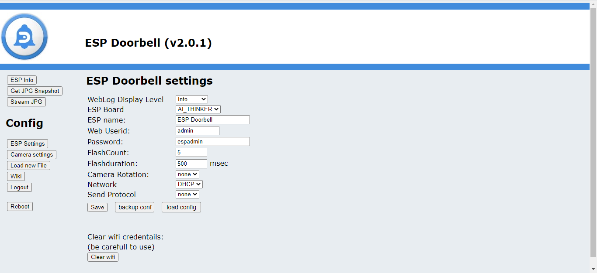
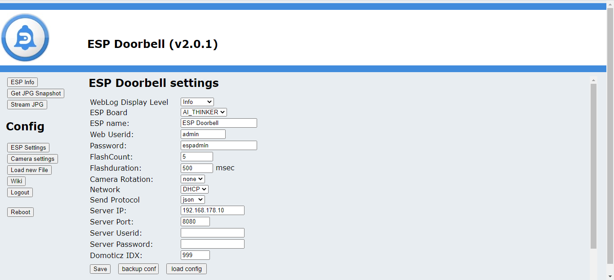
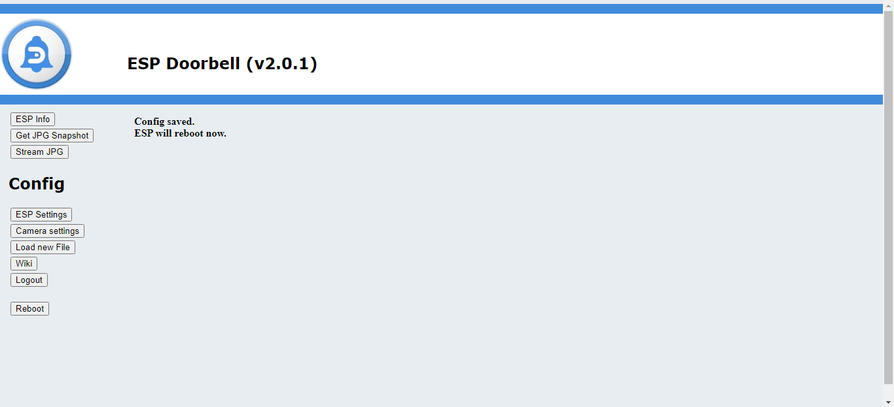
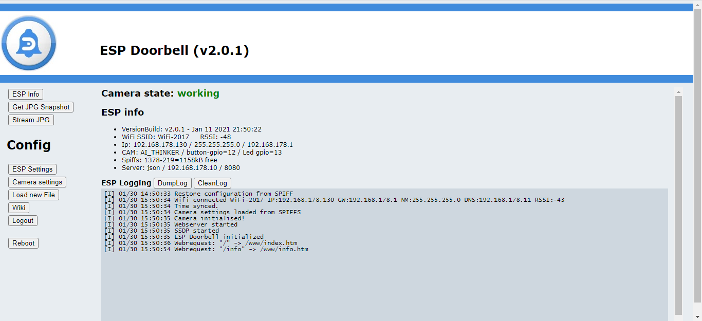

# ESPCAM V2

# HTTP/JSON Setup

To setup HTTP/JSON for sending a command when button is pushed, go to "ESP Setting" menu

Choose at the function "Send Protocol" for "json"

The next setup lines will appear:
- Server IP = the ip address of the mqtt server
- Server Port = the port number for the mqtt server
- Server Userid = if you have a secure domoticz server, fill in used name
- Server Password = if you have a secure domoticz server, fill in password
- Domoticz IDX = the idx number of your device in domoticz, which has to be switched when button is pushed.

Change the settings to your environment and click on "save"
When clicked on "save", the ESP32 Doorbell will confirm and restart

After restart, the ESP32 doorbell will come back in "ESP Info"

These commands could be send to ESP doorbell, to controll the functions

      LED On
- http://192.168.xxx.xxx/message?command={%22led%22:%22on%22}
      LED Off
- http://192.168.xxx.xxx/message?command={%22led%22:%22off%22}
      ESP Reboot
- http://192.168.xxx.xxx/message?command={"reboot":""}