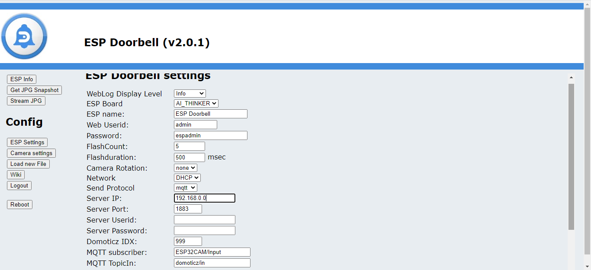

# ESPCAM V2

# MQTT Setup

To setup MQTT for sending a command when button is pushed, go to "ESP Setting" menu

The next setup lines will appear:
- Server IP = the ip address of the mqtt server
- Server Port = the port number for the mqtt server
- Server Userid = if you have a secure mqtt server, fill in used name
- Server Password = if you have a secure mqtt server, fill in password
- Domoticz IDX = the idx number of your device in domoticz, which has to be switched when button is pushed.
- MQTT subscriber
- MQTT TopicIN

Change the settings to your environment and click on "save"

When clicked on "save", the ESP32 Doorbell will confirm and restart

After restart, the ESP32 doorbell will come back in "ESP Info"
Check in the "ESP Logging" that the MQTT = connected.

These commands could be send to ESP doorbell, to controll the functions
      
      LED On
- mosquitto_pub -h 192.168.xxx.xxx -t 'ESP32CAM/Input' -m '{"Led":"on"}'
      LED Off
- mosquitto_pub -h 192.168.xxx.xxx -t 'ESP32CAM/Input' -m '{"Led":"off"}'
      ESP Reboot
- mosquitto_pub -h 192.168.xxx.xxx -t 'ESP32CAM/Input' -m '{"reboot":""}'